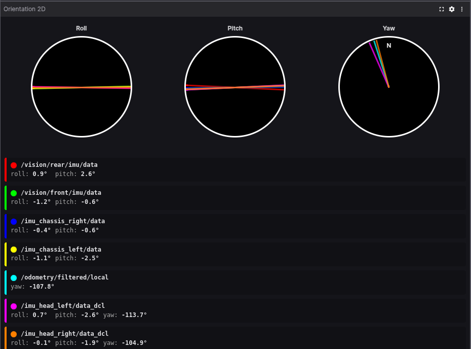

# Orientation Panel 2D for Foxglove Studio

A 2D visualization panel for orientation data from ROS messages with toggleable roll, pitch, and yaw displays.

## Features

- Visualize roll, pitch, and yaw from orientation data
- Support for multiple topics simultaneously
- Color-coded indicators for each topic
- Individual control over which components (roll, pitch, yaw) to display per topic
- Global toggles for roll, pitch, and yaw displays
- Visibility toggle for each topic directly from the settings panel

## Screenshot



## Supported Message Types

- `sensor_msgs/Imu`
- `nav_msgs/Odometry`

## Installation

1. Download the latest `.foxe` file from the [Releases](https://github.com/your-username/foxglove-orientation-panel-2d/releases) page
2. In Foxglove Studio, go to `Extensions` → `Install Extension...`
3. Select the downloaded `.foxe` file

## Usage

1. Add the "Orientation Panel 2D" panel to your layout
2. Open the panel settings
3. Enable the orientation topics you want to visualize
4. Configure which components (roll, pitch, yaw) to display for each topic

## Development

### Prerequisites

- Node.js (v16+)
- Yarn

### Setup

```bash
# Install dependencies
yarn install

# Build the extension
yarn build

# Package the extension
yarn package

# Install the extension locally for testing
yarn local-install
```

## License

MIT
